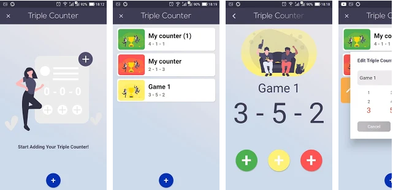
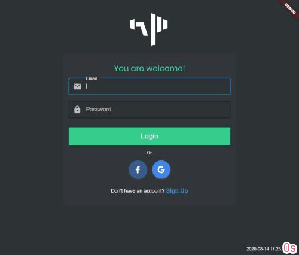

## Flutter Dash Clock Challenge  [01/2020]
  

## Triple Counter (Flutter) [05/2020]
##### Used:
* Provider v3 architecture [Tutorial](https://www.filledstacks.com/post/flutter-provider-v3-architecture/)
* pref_dessert [pref_dessert](https://pub.dev/packages/pref_dessert)

WEB: https://triple-counter.web.app/  
GooglePlay: [Triple Counter](https://play.google.com/store/apps/details?id=app.web.triple_counter)

## Volume Power [in progress]
##### Used:
* Bloc Library v6.0.x (https://bloclibrary.dev/)
* Appwrite (https://appwrite.io/)

